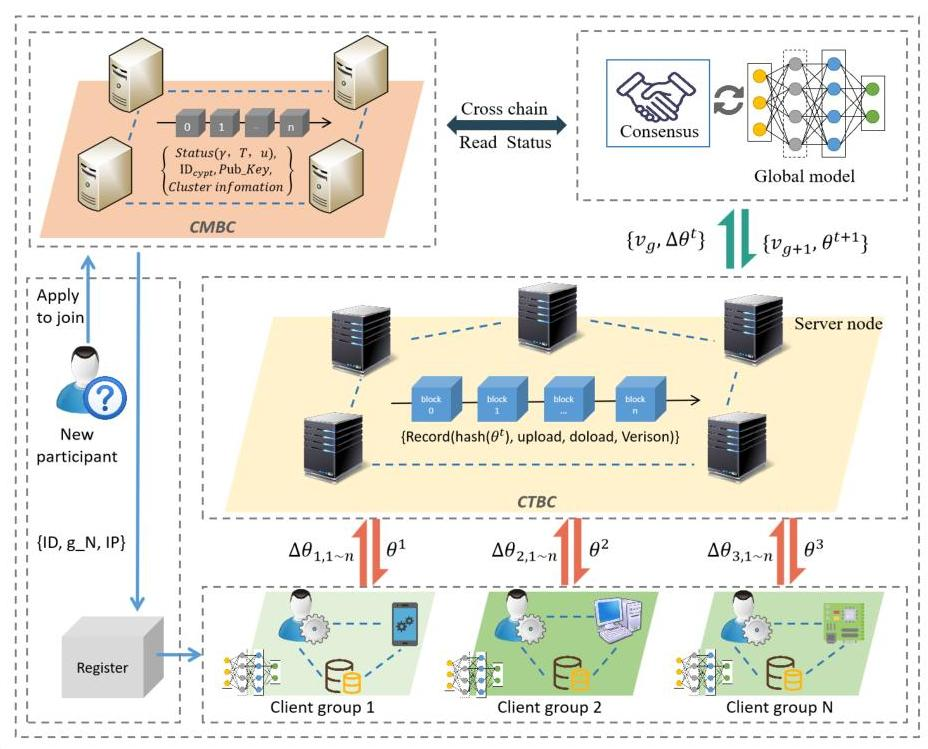
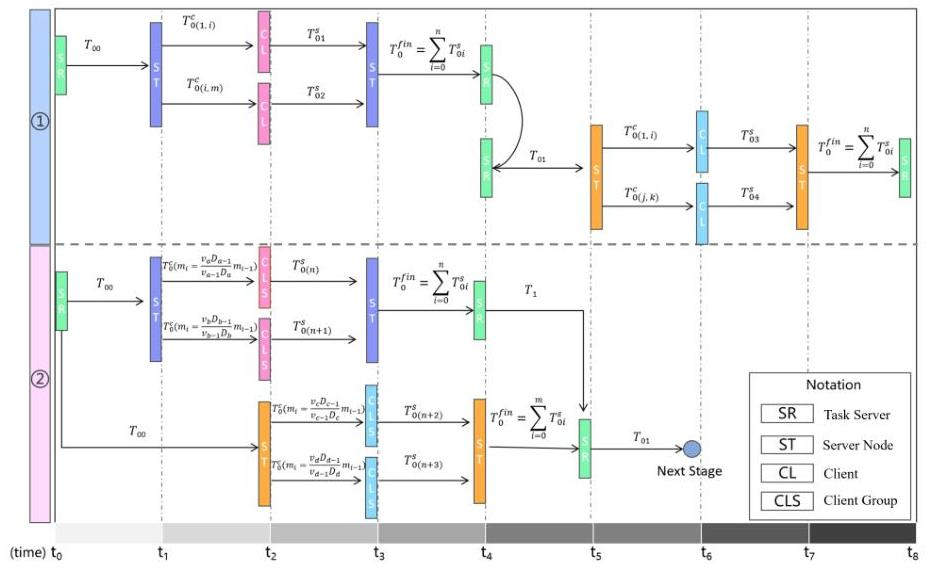
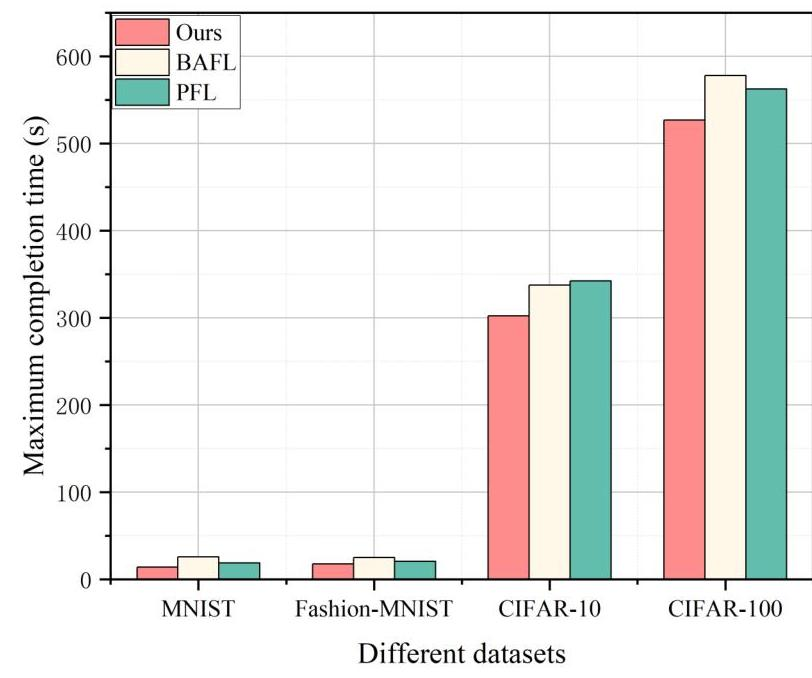
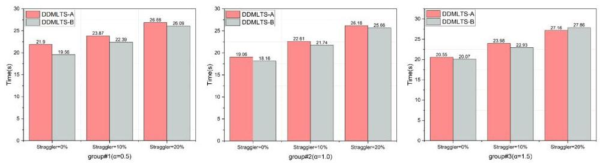
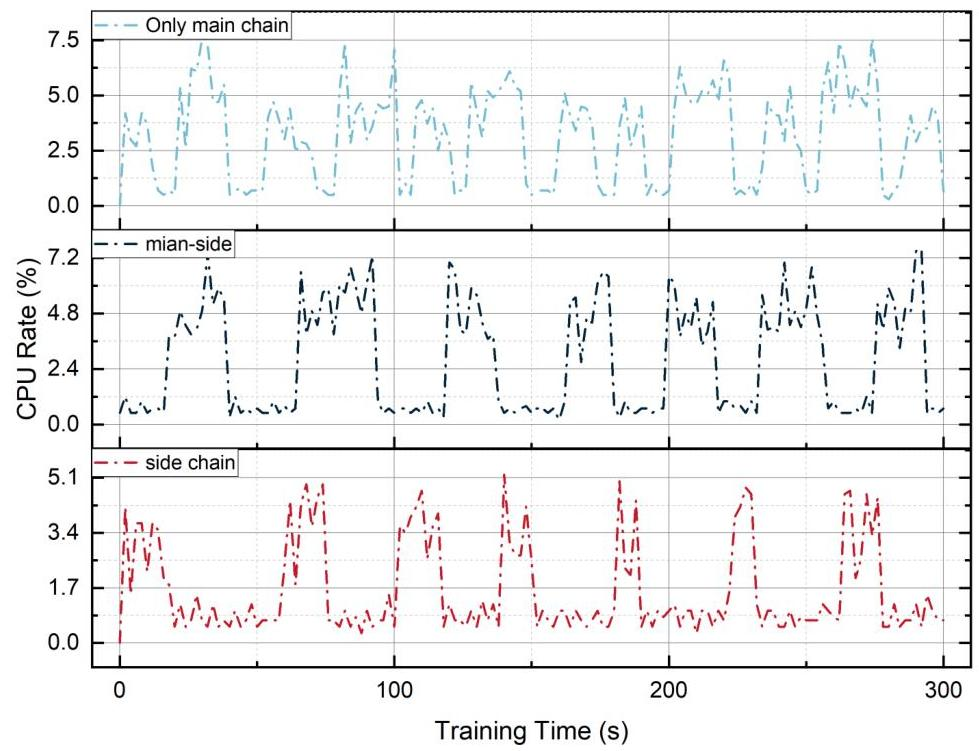
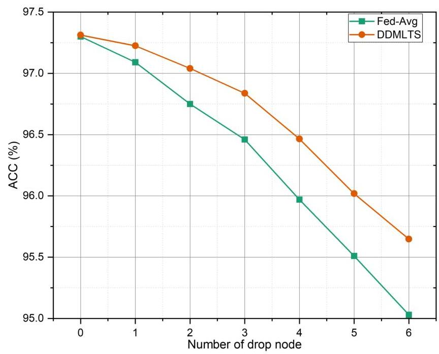
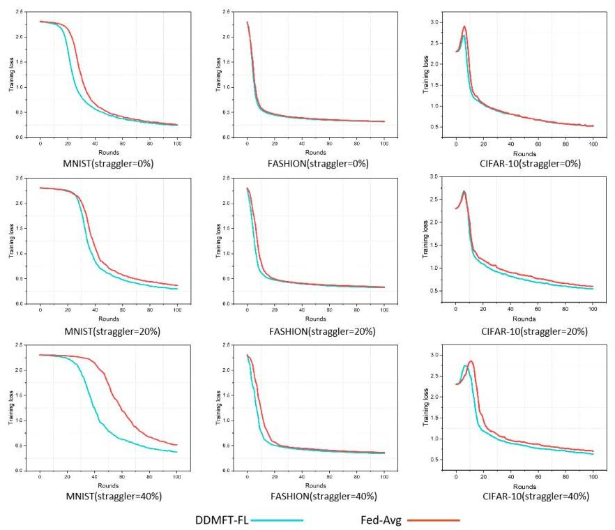
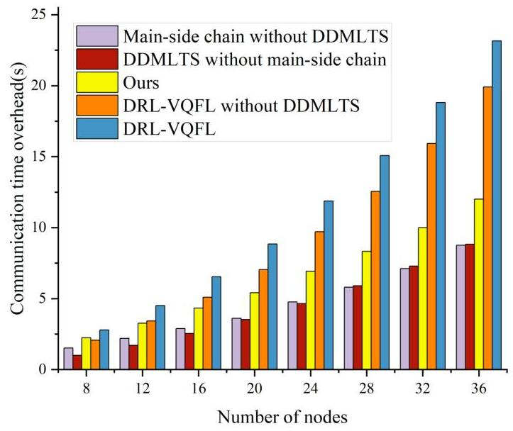
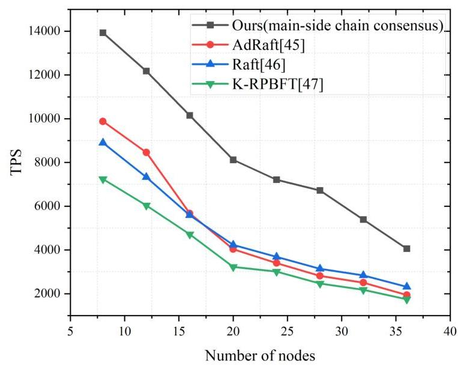
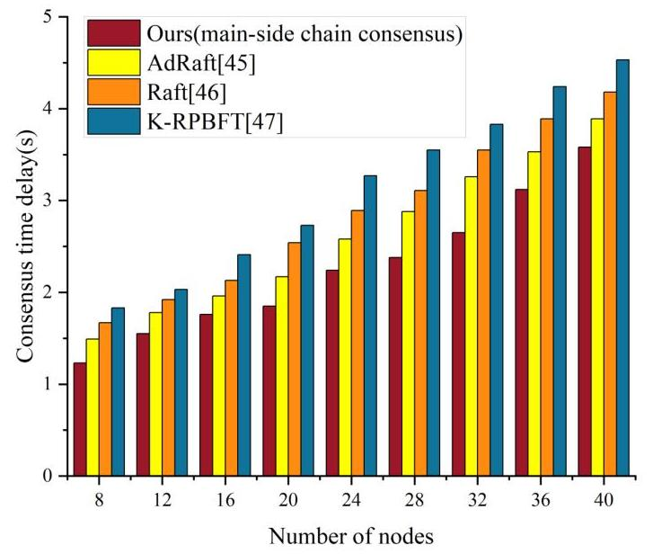

# Asynchronous Federated Learning of Main-Side Chain Collaboration for Multi-Level Task Scheduling in IoT


#### Abstract

Currently, the Internet of Things (IoT) boasts a multitude of applications, and the count of devices is escalating rapidly. Therefore, IoT systems need smarter ways of collecting and processing data to provide decision-making services to the consumer more quickly. The combination of federated learning and blockchain offers a novel way to solve the value extraction of massive data in IoT. However, due to the limitation of device computational capacity, heterogeneity of computational resources, and the straggler effect caused by frequent state changes of nodes, those issues in present blockchain-based federated learning still exist, especially in the complex IoT environment where the problem is more obvious. Aiming at the resource-constrained IoT systems, we propose an asynchronous FL framework that leverages main-side chain collaboration within a dual-chain architecture and dynamically allocates clients into groups according to their processing capacity and network performance. Furthermore, this framework employs a multi-level task scheduling strategy based on the deadline-driven maximal completion time algorithm (DDMLTS) for FL, and a side-chain approach is integrated to enhance security assessment and node scheduling. Experiments demonstrate that the framework reduces the average completion time by about $10.9 \%$ lower than BAFL and $8.8 \%$ lower than PerFedS2 in the same IoT environment. Additionally, the model's accuracy registers a maximum improvement of $2 \%$ even when faced with significant disparities in computing capabilities. Our scheme exhibits accelerated convergence and enhances model quality.


Keywords: Asynchronous federated learning, Blockchain, Internet of Things, Task scheduling, Distributed Systems

## 1 Introduction

The Internet of Things (IoT) has become integral to modern society, with billions of devices generating vast amounts of data [1]. While this data holds immense potential, its utilization is hampered by significant security and privacy challenges [2]. Users are often reluctant to share sensitive information captured by IoT devices, creating major obstacles for traditional centralized data processing models [3]. Federated learning

(FL) offers a solution by allowing clients to collaboratively train a model on their local data, sharing only model updates instead of raw information [4, 5]. While FL enhances privacy, its reliance on a central server for aggregation introduces a single point of failure and a potential target for attacks [6]. To address this centralization risk, blockchain technology provides a decentralized alternative. It enhances FL's security and efficiency by providing an immutable ledger for tamper-proof model updates [7] and replacing the vulnerable central server with a decentralized consensus mechanism to prevent single-point manipulation and bottlenecks [8, 9]. Therefore, blockchainbased federated learning (BFL) in IoT architectures can process data more securely and efficiently.

While several BFL frameworks have been proposed, their application in complex IoT environments remains challenging. Many existing approaches are built upon a single-chain architecture, where all operations compete within the same consensus cycle. For example, Chain FL [10] stores the global model directly on the blockchain, a design that ensures model consistency but results in a significant increase in aggregation time and creates severe performance bottlenecks.

Similarly, some frameworks utilize the blockchain as a trusted aggregator for collecting client models [11]. However, this approach still centralizes a key part of the process and can result in performance degradation due to added complexities such as differential privacy. This monolithic design not only interrupts the core learning task but also fails to address the unique dynamics of IoT environments. Beyond these architectural limitations, the performance of existing frameworks is often severely degraded by the straggler effect. This phenomenon occurs when a few slow or temporarily disconnected devices delay the entire training process [12]. Moreover, these frameworks lack sophisticated, dynamic task allocation strategies. As a result, poorly performing clients are often assigned workloads they cannot handle, which leads to wasted computational cycles and prolonged training times [13]. These compounding issues highlight a critical need for a BFL architecture specifically designed for resource-constrained and dynamic IoT systems.

To tackle these challenges, we devise an innovative asynchronous FL framework that fosters main-side chain collaboration. The primary contributions of our work are outlined as follows:

- A dual-chain structure of an asynchronous federated learning framework for IoT is proposed. The two blockchains of the framework are the Core Task Blockchain (CTBC) and the collaborative management blockchain (CMBC), where the task chain is responsible for the federated learning computational tasks, and the network tuning algorithms and the pre-training tasks are offloaded to the collaborative management chain, which reduces the computational pressure on the main chain.
- A real-time dynamic client group allocation algorithm is developed. It utilizes state vectors and formulates target functions to facilitate the process of client group selection and client allocation. This strategic approach effectively mitigates the impact of stragglers and the uneven client distribution on FL, leading to enhanced performance and reduced training latency.
- A multi-level task scheduling with a minimum deadline-driven maximal completion time algorithm (DDMLTS) is proposed. This method involves task distribution

Table 1 Comparison of Federated Learning Frameworks

| Schemes | Asynchronous <br> Mechanism | Blockchain <br> Architecture | Dynamic <br> Aggregation | Task <br> Scheduling |
| :--: | :--: | :--: | :--: | :--: |
| AFOWN [14] | $\checkmark$ | $\times$ | $\checkmark$ | $\times$ |
| FL with DT [13] | $\checkmark$ | $\times$ | $\checkmark$ | $\checkmark$ |
| FedQNN [15] | $\checkmark$ | $\times$ | $\times$ | $\times$ |
| AsyDFL [16] | $\checkmark$ | $\times$ | $\checkmark$ | $\checkmark$ |
| BAFL [17] | $\checkmark$ | $\checkmark$ | $\checkmark$ | $\times$ |
| OLAR [18] | $\times$ | $\times$ | $\times$ | $\checkmark$ |
| FedAdapt [19] | $\times$ | $\times$ | $\times$ | $\checkmark$ |
| PerFedS2 [20] | $\checkmark$ | $\times$ | $\times$ | $\checkmark$ |
| CFL [21] | $\times$ | $\times$ | $\checkmark$ | $\checkmark$ |
| FedSeq [22] | $\times$ | $\times$ | $\checkmark$ | $\checkmark$ |
| DRL-VQFL [23] | $\times$ | $\times$ | $\times$ | $\checkmark$ |
| FedOPT [24] | $\times$ | $\times$ | $\checkmark$ | $\checkmark$ |
| Edge FL [25] | $\times$ | $\times$ | $\checkmark$ | $\checkmark$ |
| Ours | $\checkmark$ | $\checkmark$ | $\checkmark$ | $\checkmark$ |

among client nodes determined by considering both deadlines and maximum completion times. The aim is to minimize the influence of queue nodes and optimize the efficiency of each round of global iteration computations.

The remaining portion of this article is structured as follows: In section 2, we introduced some current research status and existing problems. Section 3 delves into the dual-chain structure and the asynchronous FL framework. This section also offers a systematic exposition of the identified problems and optimization objectives. In section 4, the calculation steps of network state parameters are given, and the task scheduling scheme is described in detail. In section 5, the scheme's effectiveness is demonstrated through a series of comparative experiments. Lastly, section 6 concludes this article.

# 2 Related Work 

Federated Learning has been widely studied, with research primarily focusing on improving model security, aggregation efficiency, and data distribution strategies. However, as FL scales to more complex and resource-constrained environments like IoT, challenges in asynchronous aggregation, client coordination, and computational efficiency become increasingly prominent. To address these issues, existing studies have explored different optimization techniques. This section reviews related work in two key areas: Asynchronous FL frameworks, which focus on improving communication efficiency and update mechanisms, and FL performance optimization, which addresses client selection, resource allocation, and task scheduling.

### 2.1 Asynchronous FL framework

In an FL session, only a subset of client nodes participate in communication, leaving others in a waiting state. Under synchronous mechanisms, some clients may become stragglers, which can reduce the model's generalization ability and prolong training time [26]. To mitigate the effects of stragglers, various asynchronous FL frameworks

have been proposed. Ji et al. [15] introduced a partial participation mechanism for IoT environments, which only a selected group of participants carry out FL training. This approach reduces overall communication overhead by limiting the number of active clients per round. However, it does not fully address device heterogeneity, as stragglers with varying computational capacities can still delay overall convergence. Building on this, Wang et al. [14] proposed an adaptive asynchronous FL framework, which adjusts global update weights based on each client's influence, helping to avoid overfitting and improve model adaptability. While asynchronous FL enhances flexibility in model updates, it still relies on a centralized server node to coordinate global updates. This dependency creates a single point of failure in large-scale networks and limits system robustness, making it less resilient to node failures or targeted attacks. To address the limitations of centralized aggregation, Liao et al. [16] developed AsyDFL, a decentralized peer-to-peer (P2P) FL framework that enables direct device-to-device communication, reducing reliance on a central server. By distributing model aggregation across participating clients, AsyDFL addresses the single point of failure inherent in centralized FL. Although this approach eliminates dependency on a central coordinator, it introduces new trust challenges. There is no reliable mechanism to ensure the integrity of contributions without a central authority to verify updates, making the system vulnerable to malicious or unreliable model updates . To address trust and security concerns in decentralized FL, blockchain technology has been integrated into FL. Feng et al. [17] proposed BAFL, a Blockchain-based Asynchronous Federated Learning Framework that supports asynchronous model uploads while leveraging an immutable ledger for secure update authentication. This ensures model integrity and enhances trust, but BAFL lacks an effective task scheduling mechanism, leading to communication inefficiencies in large-scale deployments. Moreover, its single-chain architecture introduces latency and processing bottlenecks by requiring all FL-related transactions (model updates, verification, and storage) to be completed within the same consensus cycle, making it less scalable in large networks.

# 2.2 Optimize FL performance 

FL systems encounter significant challenges due to device heterogeneity, limited resources, and non-uniform data distribution. Existing optimization approaches can be analyzed through two critical dimensions:

Cluster Allocation and Client Selection Methods focus on grouping heterogeneous clients and selecting appropriate participants. Chen et al. [22] put forward a hybrid FL architecture that clusters clients on account of data characteristics to address independent and identically distributed (IID) data training, where only cluster heads upload model updates to reduce communication overhead. However, their static clustering strategy fails to adapt to dynamic device state variations. Su et al. [21] developed a dynamic client scheduling scheme that organizes clients into client groups based on local data distributions and trains separate models for different groups, but it lacks flexibility in complex IoT environments and cannot respond to real-time device state changes. Li et al. [25] introduced adaptive client selection leveraging computational capabilities, energy states, and data quality for resource scheduling, but it lacks a global optimization mechanism to balance resource allocation across clusters. While

Ahmed et al. [24] optimized resource allocation among heterogeneous clients through the FedOPT framework, its computational complexity grows significantly with device scalability. A prevalent limitation of these approaches lies in their lack of real-time dynamic cluster allocation mechanisms, resulting in inefficient resource utilization and persistent system performance degradation due to skewed client distributions.

Task Scheduling and Computational Resource Optimization Methods aim to allocate computing tasks and utilize resources effectively. Wu et al. [19] alleviated client computation pressure in FedAdapt by partially offloading DNN layers to servers, but this strategy suffers from substantial training speed reduction in unstable network environments. Zhang et al. [23] employed reinforcement learning (RL) in DRL-VQFL to optimize quantization and resource allocation, yet the computational demands of RL pose critical bottlenecks in resource-constrained systems. You et al. [20] proposed a semi-synchronous Personalized Federated Learning (PFL) algorithm, PerFedS2, which optimizes wireless bandwidth allocation and client scheduling. However, its requirement for rescheduling when new clients join increases operational complexity in dynamic scenarios. Pilla et al. [18] minimized training round duration in OLAR by controlling client data usage, but its assumption of stable resource distributions limits applicability in dynamic environments. To summarize and compare these frameworks, Table 1 presents an overview of key federated learning approaches discussed in the previous sections. These methods share a critical shortcoming as they primarily focus on individual optimization goals while lacking a multi-level task scheduling strategy that simultaneously considers deadlines, completion times, and other constraints, thereby compromising the efficiency of global iteration computations.

# 3 Asynchronous FL Framework for Main-Side Chain Collaboration 

Blockchain-based federated learning may face challenges in complex IoT environments due to the limitations of the single-chain model and heterogeneity in computational resources, resulting in performance degradation or failure to complete training tasks. In this paper, FL training tasks are assigned to the clients based on computational capability and bandwidth limitations, and then weight calculations for global aggregation are adjusted accordingly. As shown in Fig. 1, we introduce a dual-chain structure to reduce the computational pressure on nodes in IoT networks. A complete network is composed of client groups, clients, and server nodes. Unlike other FL frameworks for IoT [27-29], the training task is split into two steps. Each server node manages a client group, which conducts training tasks. A blockchain network of multiple server nodes ensures the security of aggregation tasks for the global model. During the training process of FL in a single blockchain architecture, newly added clients can interfere with the original model aggregation work, and the initiation of consensus can lead to the global training of federated learning being blocked due to network adjustments. Therefore, the main-side chain collaborative scheme introduced in this article increases the stability of the networks. It is composed of CTBC and CMBC, where the



Fig. 1 Asynchronous Association Learning Framework for Double-Chain Architecture.

CTBC responsible for FL model training and aggregation operations, and the CMBC responsible for performing cluster scheduling and node security evaluation.

# 3.1 System Model 

The proposed framework establishes a clear distinction between server and client roles. In this design, CTBC is composed of server nodes, while clients join the blockchain network. Server nodes act as the back bone of the CTBC blockchain, coordinate the FL process for their assigned client groups, and participate in the consensus mechanism to maintain the global model state. This design reduces network size while maintaining a decentralized environment for FL training. CTBC manages the entire FL training process, including model transmission, aggregation, and version updates, thereby executing core training tasks and generating the global model. Meanwhile, CMBC handles network optimization, security evaluation, and performance assessment of newly added clients, recording relevant node information and assigning clients to client groups with similar states based on their performance. Using a dedicated blockchain (CMBC) for these management functions provides enhanced trust and transparency compared to a traditional centralized server. It creates a tamper-proof and auditable record of crucial management data, such as node status assessments and client group assignments, which is valuable for coordination among server nodes. Updates regarding the set of

participating server nodes, such as a new node joining, are handled via a two-stage process that leverages the dual-chain architecture. The requesting node's information is first recorded on the CMBC. This administrative record is then proposed to the CTBC for final validation. To officially integrate the new node into the trusted operational network, the CTBC server nodes must reach consensus on this change. After a consensus round on CTBC is successfully completed, the node is formally integrated into the network, authorizing it to manage client groups and participate in FL tasks. To ensure efficient model aggregation, CTBC employs a main-side chain consensus mechanism in which server nodes dynamically form committees to oversee and coordinate gradient aggregation and model version control.

During the training process, CTBC receives gradient information from client groups and performs model aggregation and distribution using the main-side chain consensus algorithm. Since nodes are verified upon registration, each node establishes a trust list of other nodes. Based on the dynamic committee mechanism of the mainside chain, server nodes manage log distribution according to the consensus protocol, while committee members cooperate to verify and broadcast the logs. After synchronizing the global model to local nodes, the client groups complete the model distribution process. Once CTBC completes a global iteration, CMBC updates the client status, reassigns client groups, and redistributes tasks accordingly.

Timeliness is crucial for gradient updates submitted by client groups during FL training. Frequent interruptions in aggregation, prompted by other transactions, exacerbate the straggler effect and compromise the global model's accuracy. Employing a synergistic approach effectively safeguards the main chain's aggregation process against disruptions from new transactions, thereby enhancing the performance of asynchronous FL. This conclusion will be validated in subsequent experiments.

# 3.2 Asynchronous FL Aggregation Algorithm 

It is difficult to determine the necessary number of local epochs for a specific client without first evaluating its computing power. Therefore, the current framework is a small subset selected from many clients to execute the model aggregation. However, clients with weak computational power have low or even useless contributions to the whole system because the slow convergence state affects the training time of the global model and even reduces the global model accuracy [30]. We will trade off the training time and accuracy of the model for each client based on the new aggregation algorithm in this article.

In the current FL Framework for IoT, the server aggregates the gradient of clients using a weighted average of the loss value[31]. Gives a dataset $D=$ $\left\{x_{i}, y_{i} \mid i=\left(1,2,3, \ldots, n_{k}\right)\right\}$, where $x_{i} \in R^{d}$, classification tag $y_{i} \in\{0,1, \ldots, c-1\}$, set $f_{i}\left(\theta_{i}\right): R^{d} \rightarrow R$ for each client $i$ corresponding to loss, $F(\theta)$ is the average loss of global model $\theta$. The optimization objective for FL training is as follows:

$$
\min _{D} F(\theta)=\frac{1}{n} \sum_{i=0}^{n} f_{i}\left(\theta_{i}\right)
$$

In the proposed framework, FL datasets are sourced from sensors under the purview of clients. These datasets are gathered by departmental server nodes operating within the same domain. Notably, each server node aligns with multiple clients, sharing the same FL domain. The FL training process follows a federated averaging approach and is primarily driven by each client group. The server node is responsible for task distribution, while clients complete and submit tasks autonomously, eliminating the need for the server to wait for updates from slow devices. The entire training process proceeds as follows:

- At system startup, nodes vote to elect the initial committee members for CTBC, selecting those with the highest votes. During operation, the committee leadership may rotate or be updated to prevent adversarial manipulation. Upon election, the committee generates an initial global model $\theta^{0}$, setting the global model version as $v_{g}$. A subset of client groups is then selected, and the initialization model $\theta^{0}$ is broadcast to them.
- After receiving the model, each selected client $i$ updates its local model using stochastic gradient descent (SGD) based on its local data and the assigned task, generating the gradient $\Delta \theta_{i}^{t}$. Subsequently, the client transmits the computed gradient to the designated leader node within the CTBC committee.
- The designated leader node collects gradients from the participating clients within a defined time window or until a sufficient number is received. Let $\mathcal{K}_{t}$ be the set of clients whose gradients are successfully received and valid for aggregation round $t$. The leader node computes the updated global model by the aggregation function:

$$
\theta^{t+1}=\theta^{t}-\frac{1}{\left|\mathcal{K}_{t}\right|} \sum_{i \in \mathcal{K}_{t}} \frac{1}{\left|v_{l}(i)-v_{g}\right|} \eta_{i} \Delta \theta_{i}^{t}
$$

Here, $\left|\mathcal{K}_{t}\right|$ is the number of clients in the participating set $\mathcal{K}_{t} ; \Delta \theta_{i}^{t}$ represents the gradient from client $i ; \eta_{i}$ is the client's learning rate; $v_{l}(i)$ means the local model version used by participant $i$; and $v_{g}$ denotes the current global model version. This rule averages the gradients from participating clients, adjusting each contribution by the learning rate $\eta_{i}$ and weighting it inversely by model version staleness $\left(1 /\left|v_{l}(i)-\right.\right.$ $\left.v_{g}\right|$ ) to mitigate asynchronous delays.

- The leader node proposes the newly computed global model $\theta^{t+1}$ to the CTBC network. The CTBC server nodes then execute the main-chain consensus protocol to validate and agree upon this new model state. Once consensus is reached, the updated global model $\theta^{t+1}$ and its corresponding version $v_{g+1}$ are immutably recorded on the CTBC blockchain. Each server node downloads the updated global model during idle time, using it as the initialization point for the next communication round.


# 4 Dynamic Task Scheduling 

The FL task has a timeliness requirement for the gradient of the model training by each client, and different clients train with different convergence degrees, which may result in the loss value being too large to converge or slowing down the convergence

speed if the gradient is uploaded to the server node for aggregation [32]. In the paper, more state parameters are introduced in the framework, and the FL clients are partitioned into many client groups and assigned to different server nodes for management in terms of hardware resources, software operation cost, and bandwidth-delay. Furthermore, a multi-level task scheduling algorithm that minimizes the time cost is used to distribute the right amount of computational tasks to different clients to reduce the global training time. The algorithm runs on the CMBC to provide the parameter basis and distribute computational tasks for clients in CTBC.

# 4.1 Network State Parameters Computing 

We consider each training round in a client group as a task. For client groups $B C_{s u b}$ with multiple state parameters, the blockchain master chain publishes tasks after completing consensus. Let $\tau$ be the design calculation task and $s, c l$ represent the server node and client, respectively. The server node releases the expected task set $\tau=\left\{\tau_{s i} \mid s i \in N^{+}\right\}$, and the client receives and calculates the $\tau_{c l}$ that forms the task to be uploaded. Once the task issued by the server node participating in consensus is complete, the client returns the data upwards, and after the server node completes aggregation, the round ends with the next round of task release and execution.

Each training task's time consists of the time that the current task calculates and the time that data is uploaded over the link. Next, we use $(X)_{i j, u}^{f}$ to indicate the state quantity $X$, which functions as $f$ from path $i$ to $j$ to the $u$ node, and symbol $\left(X_{i}\right)_{u}^{f}$ indicates the state quantity $X_{i}$ of the node $u$. For cluster tasks $\tau_{u}$, the calculation time $t_{u}^{c m t}$ is as the equation 3. $c_{u}$ represents the total task amount, and $p_{u}$ represents the calculation speed of the client.

$$
t_{u}^{c m t}=\frac{c_{u}}{p_{u}}
$$

When the client in the client group finishes training and the server node is idle, data transfer occurs and the client's model gradient is consolidated on the server node. For tasks $\tau_{u}$, when computed from the $i$ node and uploaded to $j$, the amount of data generated is $d_{k}$ and the path length is $P$. For the double-tier system structure in this article, the condition $\left|P_{v \widehat{v}}\right| \leq 3$, the $b_{i j}$ is the bandwidth of the link, which transfer time $t_{i j, u}^{t r s}$ is calculated as follows:

$$
t_{i j, u}^{t r s}=\frac{d_{k} \cdot\left|P_{i j}\right|}{\min _{i \in P} b_{i j}}
$$

In this system, the start time of each client is determined by the computing power and completion time of the server node and clients. The client must obtain the necessary data before beginning a new round of calculations. Thus, the start time $t_{u}^{s t}$ of the node $u$ is calculated as follows:

$$
t_{u}^{s t}=\max \left(t_{u}^{f i n}, \max _{\forall\left(t_{i j}\right)}\left(S_{u}^{r e s}+t_{v \widehat{v}}^{t r s}\right)\right)
$$

The task completion time from $i$ to $j$ is the sum of the current wait task start time and task execution time, which is approximately the same for all clients in the client group, satisfying the condition $t_{i j, u}^{f i n} \in\left(t_{0}-\Delta t, t_{0}+\Delta t\right)$. The task completion time is calculated as follows:

$$
t_{i j, u}^{f i n}=t_{u}^{s t}+t_{u}^{c m t}
$$

The global dataset is $D$ and the task data size is $d_{k} \in D$. Design speed $v_{u}$ to assess the approximate completion time of each client under a certain dataset, as a basis for adjusting cluster tasks and quantities at initialization, calculated by equation 7.

$$
v_{u}=\frac{d_{k}}{t_{u}^{c m t}}
$$

One of the key factors that affect the speed of FL training is the round-trip delay of nodes in the network when transmitting or receiving tasks. However, in complex IoT structures, intermediate nodes need to monitor states between nodes to reduce computing and network impact. In this paper, the side chain is utilized to monitor and calculate status. The round trip delay is expressed as $t_{i j, u}^{r t t}$. We measure the current state of the client using a state vector $\gamma$. However, the impact of each state on task scheduling is inconsistent due to their weak correlation. This article uses the coefficient $\epsilon_{i}$ for weight adjustment to ensure that each state can more carefully reflect the performance of the device. The state vector designs are given in formula 8.

$$
\gamma=\left(\epsilon_{1} \cdot t_{i j, u}^{r t t}, \epsilon_{2} \cdot t_{i j, u}^{f i n}, \epsilon_{3} \cdot v, \mu\right)
$$

where $u=\frac{r d f}{K}, \mu$, and $K$ denote the device failure rate and number of disconnected, respectively, and $t_{u}^{d f}$ indicates the node history failure or disconnected time. The parameter $\epsilon$ satisfies $\epsilon_{1}+\epsilon_{2}+\epsilon_{3}=1$. The values for these weighting coefficients, $\epsilon_{i}$, are set to provide a balanced representation of network latency, computational speed, and node reliability. In line with common practice in resource-aware federated learning where multiple heterogeneous factors are considered [33], we assign equal weights $\left(\epsilon_{1}=\epsilon_{2}=\epsilon_{3}=1 / 3\right)$ in our experiments. This approach establishes a robust and unbiased baseline, ensuring that no single factor dominates the client selection process.

# 4.2 Dynamic updating and initialization 

During the initialization phase, different clients produce different training speeds in the newly added $n$-node network due to hardware platform and network state limitations. In the framework of this article, a server node is used to manage multiple clients, optimizing the client group according to the least discrete objectives to bring the training tasks to a minimum completion time. The calculation method is as follows:

$$
\sigma=\min _{\gamma \in B C_{s u b}}\left\{\frac{1}{n} \sum_{i=1}^{n}\left(\left\|\gamma_{i}\right\|-\|\widehat{\gamma}\|^{2}\right)\right\}^{\frac{1}{2}}
$$

```
Algorithm 1 Dynamic clustering client for \(B C_{\text {sub }}\)
Input: The state vector \(\gamma\), Maximum clusters \(K_{\max }\)
Output: Collection \((\sigma, K), B C_{\text {sub }}\)
    Set Queue \(=\emptyset, K=2, \sigma=0, \Sigma_{t m p}=\infty\);
    while True do
        if \(K>K_{\max }\) then
            Break;
        end if
        Set \(B C=\) Clustering by \(\gamma\) use \(K\) and return \(B C_{\text {sub }}\);
        if Queue is not empty then
            Getting element \((K, \Sigma)\) from Queue
            if \((K, \Sigma) \leftarrow \Sigma<\sigma\) then
                Break;
            end if
            for \(\forall b c \in B C\) do
                \(\sigma=\min _{\gamma \in B C_{\text {sub }}}\left\{\frac{1}{n} \sum_{i=1}^{n}\left(\left\|\gamma_{i}\right\|-\|\bar{\gamma}\|^{2}\right)\right\}^{\frac{1}{2}} ;\)
                \(\Sigma_{t m p}=\Sigma_{t m p}+\sigma\);
            end for
            Put \(\left(K, \frac{1}{K} \cdot \Sigma_{t m p}\right)\) in the Queue;
            \(\Sigma_{t m p}=\frac{1}{K} \cdot \Sigma_{t m p}\);
    end if
        \(K=K+1\);
    end while
    return Queue, \(B C\);
```

where $\gamma$ represents the network state vector and $\widetilde{\gamma}$ is the average state vector for the current server node. Clusters and calculates $\delta$ for all newly added nodes, forming a client group $B C_{\text {sub }}$ through continuous iterative adjustments.

Initialization: Firstly, the system will cluster once with $K=2$, dividing each client into different client groups. Secondly, calculate the current dispersion $\Sigma_{t m p}=$ $\frac{1}{K} \cdot \sum_{1}^{n} \sigma_{i}$, if the current $\Sigma_{t m p}$ is larger than the $\sigma$ of the previous turn, then $K=K+1$, for the second round of clustering operations. We assume that after $\chi-1$ rounds of clustering. The current $K=\chi$ satisfies the condition $\Sigma_{\chi}<\sigma_{\chi-1}$. Get the $B C s$, the least discrete client group in the system. At this point, each client group has an approximate state, computing power, bandwidth size, etc. Assign each client group $B C_{\text {sub }}$ to server-side management based on the current calculation. The adjustment algorithm strategy at initialization is shown in Algorithm 1. To ensure the algorithm terminates within practical bounds and prevent an excessive number of client groups, a predefined maximum number of clusters, $K_{\max }$, is introduced as an additional stopping criterion for the iterative process.

Update: During the FL training, when a new node joins the network, the algorithm is executed. Firstly, connect the new node to the side chain and calculate the status $d_{i}$. Secondly, the current maximum state of $d_{\max }$ and minimum state of $d_{\min }$ is evaluated on a circular basis for each client group $B C_{\text {sub }}$. If the condition

Algorithm 2 Network updates when new participants join
Input: The state vector $\gamma_{\text {new }}$ and client group $B C_{\text {sub }}$
Output: The client group $p$
Set $d_{i}=\left\|\gamma_{\text {new }}\right\|_{2}^{2}$;
for $\forall b c \in B C_{\text {sub }}$ do
Set $d_{\text {max }}=\max _{\gamma \in B C_{\text {sub }}}\left\|\gamma_{\text {new }}\right\|_{2}^{2}$ Set $d_{\text {min }}=\min _{d \in B C_{\text {sub }}}\left\|\gamma_{i}\right\|_{2}^{2}$;
if $d_{i} \in\left[d_{\text {min }}, d_{\text {max }}\right]$ then
Add new node to the BC ;
end if
end for


Fig. 2 Dynamic Task Scheduling Time Diagram ( $\bigcirc$ ) is the traditional FL Scheduling Method, (2) is the multi-level task scheduling based on the deadline-driven maximal completion time algorithm in this article).
$d_{i} \in\left[d_{\text {min }}, d_{\text {max }}\right]$ is met, the node is added to the current client group, otherwise, the client group is skipped. The network update algorithm when adding a new node is described as algorithm 2 .

# 4.3 Multi-level FL Task Scheduling 

Our proposed approach addresses the problem of scheduling the same and independent tasks on limited resources for multiple rounds of federal learning at each stage. In the section 4.1, We consider a phase of FL training as a total task of $\tau^{\text {tout }}$, there is a dependency between multiple phases of the task, and the input of the phase $i+1$ task is the task output of phase $i$. That is, $\tau_{i}^{\text {total }} \in \tau_{i+1}^{\text {total }}$ and $\tau_{i+1}^{\text {total }}=\tau_{i}^{\text {total }}+\Delta$. To separate tasks under certain conditions, We split a phase task into subtasks $\tau_{i}^{\text {sub }}$. These subtasks are independent of each other, and the computational resources consumed

are dynamically divided according to existing performance. Our goal is to find a way to allocate $A_{i}\left(A_{i} \in \tau_{i}^{s u b}\right)$, so that the current deadline for a maximum completion time of $C_{\max }$ is minimized while maintaining training accuracy.

$$
C_{\max }=\max _{i \in N_{+}}\left(C_{i}\left(A_{i}\right)\right), A_{i} \in \tau_{i}^{s u b}
$$

Time costs include the time it takes to transfer models between FL server nodes and clients and the time it takes to train models with a certain amount of data. The limited computational resources are independent of each other, and the time spent by the task in using these resources is not diminishing, but there is an upper and lower limit, and the time consumed by the $k$ resource is in the relationship between the lower bound $l$ and the upper bound $u$ as formula (11).

$$
\begin{gathered}
C_{i}(k) \leq C_{i}(k+1), \forall i, k \in N_{+} \\
l \leq \tau \leq u, \sum_{i \in N_{+}} A_{i}=\tau
\end{gathered}
$$

Finding the best way to allocate resources by iterating more and more tasks. It mainly merges resources based on the previous task $i$ with resources based on the next task $i+1$. Package tasks from top to bottom for distribution. Set a queue to store the time cost of adding tasks to each resource. Continuously adjust the number of tasks per client based on minimum time, and optimal task allocation for all clients can be obtained at minimal cost. Putting each round of training tasks into the server node's compute queue, which is proactively obtained and calculated by the client and uploaded immediately after completion, thus the cost can be minimized.

The deadline completion time can be set to $C_{i}(k) \approx t_{i j, u}^{f i n}$. Assuming the size of the client dataset being used is $D_{i}^{*}$, the number of tasks is $m$, and each cluster has a total of $n$ clients. To reduce the maximum completion time, it needs to decrease the impact of the straggler effect. According to the condition $C_{0} \approx C_{1} \approx C_{2} \ldots \approx C_{n}$, means $C_{n} \approx C_{n-1}$, the current deadline is $D L$. In the $t_{0}$ moment, it can be described by the following formula 12 .

$$
\begin{gathered}
C_{n}=C_{n-1} \stackrel{t_{0}=D L}{\Longrightarrow} t_{i j, u}^{f i n}(n)=t_{i j, u}^{f i n}(n-1) \\
\Longrightarrow \frac{D_{n}^{*} \cdot m_{n}}{v_{n}}=\frac{D_{n-1}^{*} \cdot m_{n-1}}{v_{n-1}}
\end{gathered}
$$

As shown in equation 13, a recursion of $m_{n}$ and $m_{n-1}$ is derived by the formula 12 , which calculates the number of tasks assigned to each client within a client group.

$$
m_{n}=\alpha \cdot \frac{v_{n} \cdot D_{n-1}^{*}}{v_{n-1} \cdot D_{n}^{*}} m_{n-1}
$$

The original FL is a server-controlled client that completes each round of training. In this article's approach, tasks can be considered distributed in a tree-like manner, with each phase of tasks gradually decomposing into small tasks from the server node

to the client group and uploading to the server node for aggregation after completing a round of calculations. The steps described are as follows:

- The FL training task commences with the publication of the initial consensus task $T_{0}$ on the CTBC, making it available to the service nodes. (Tasks are generally denoted as $T_{p v}$, representing phase p of version $v$.)
- Upon receiving task $T_{0}$, the service node initiates the process by randomly selecting a client within the client group to serve as the anchor point. Then, it computes the task count per client using the current anchor client as a basis, as described in equation 13, denoted as $T_{i}^{v}$. Subsequently, it retrieves the task list $T^{v}$ and allocates the tasks to the clients for FL training.
- Each client starts training after receiving the corresponding task and aggregates on the server node after completion. A global model $\theta$ will be generated after the main blockchain initiates a consensus, and the side chain recording the current model version information.

To be clear, our task scheduling mechanism operates by allocating computational workloads rather than data. The scheduler determines the amount of local computation for each client (quantified by the number of training batches $m_{n}$ ), then the client performs exclusively on its own private dataset $D_{n}^{s}$. This approach ensures that data always remains local to each client, thereby upholding the privacy constraints of federated learning and guaranteeing that assigned tasks are always feasible with the client's available data.

Consider each round of training tasks as a scheduling task. Traditional FL is to randomly select a batch of clients to distribute the equivalent amount of tasks, waiting for each client to complete the aggregation. This paper adopts the multi-level task scheduling based on the deadline-driven maximal completion time algorithm, assigning tasks to a non-equivalent amount, and assuring that each client will complete during the same time according to its performance and dataset size. As shown in Fig. 2, this solution boasts advantages such as mitigating the impact of stragglers and accelerating the speed of each training round. Each task distribution requires only a small amount of calculations to complete, with little impact on the entire FL training.

# 4.4 Computational Complexity Analysis 

A detailed computational complexity analysis is presented to assess the scalability and efficiency of the DDMLTS algorithm and the dynamic cluster allocation method. The analysis focuses on four key components that influence the overall performance of the framework:

- Dynamic Clustering and Task Allocation: During the task allocation phase, the server node computes state vectors for all clients and performs K-means++ clustering. The complexity of K-means++ [34] is $O(n k I)$, where $n$ represents the number of clients, $k$ means the number of clusters, and $I$ is the number of iterations required for convergence. To optimize this process, we employ Mini-Batch K-means[35], reducing $I$ to a small constant, thereby lowering the computational burden.

Table 2 Comparison of Computational Complexity Across Different FL Algorithms

| FL Algorithm | Computational Complexity |
| :-- | :--: |
| BAFL | $O\left(n^{2}\right)$ |
| PerFedS2 | $O(n m)$ |
| FedAvg | $O(n k)$ |
| Proposed Method | $O(n k I)+O(n m)+O(k T)$ |

- Task Scheduling and Assignment: The system dynamically distributes tasks based on computational capabilities to minimize the maximum completion time. Given $n$ nodes and $m$ tasks, the complexity of task assignment is $O(n m)$.
- Asynchronous Training and Gradient Aggregation: Each client independently executes local training using stochastic gradient descent (SGD), leading to a computational complexity of $O(k)$, where $k$ is the number of model parameters. Combining the dynamic clustering strategy with the Nesterov[36] acceleration framework, the global convergence time is affected by the data drift coefficient $T$, making the complexity of this stage $O(k T)$.
- Dual-Chain Collaborative Aggregation and Model Synchronization: The aggregation process in our framework utilizes a dual-chain collaborative mechanism, reducing the computational load on the primary blockchain. The weighted sum operation for gradient aggregation has a complexity of $O(n k)$, while cross-chain synchronization introduces a minimal additional complexity of $O(k)$.

Summarizing the above analysis, the computational complexity of the proposed framework is given by $O(n k I)+O(n m)+O(k T)$, where the dominant terms determine the overall scalability and efficiency of the system. In large-scale federated learning scenarios, the number of tasks $m$ and model parameters $k$ are typically moderate, whereas the number of participating clients $n$ is significantly larger. Thus, by leveraging optimized clustering and adaptive scheduling strategies, the overall complexity growth can be efficiently controlled, ensuring that the framework remains computationally feasible as the network scales.

Table 2 presents a comparison of the computational complexity of the proposed method with conventional FL scheduling algorithms. The BAFL method suffers from a quadratic complexity $O\left(n^{2}\right)$ due to full-mesh gradient aggregation, making it impractical for large-scale IoT applications. The PerFedS2 framework is constrained by synchronous barriers, leading to a computational complexity of $O(n m)$, which limits its efficiency in highly distributed environments. In contrast, the proposed framework, through optimized clustering, dynamic task scheduling, and asynchronous aggregation, achieves a scalable complexity structure that is well-suited for heterogeneous and large-scale federated learning systems.

Table 3 Global completion times of each round and accuracy for different data sets under different methods

|  | DDMLTS |  | BAFL[17] |  | PerFedS[20] |  |
| :-- | :--: | :--: | :--: | :--: | :--: | :--: |
| Datasets | Accuracy | $C_{g \max }(\mathrm{~s})$ | Accuracy | $C_{g \max }(\mathrm{~s})$ | Accuracy | $C_{g \max }(\mathrm{~s})$ |
| MNIST | 97.55 | 14.13 | 97.56 | 25.72 | 97.38 | 18.89 |
| Fashion-MNIST | 83.41 | 17.76 | 83.77 | 25.16 | 83.92 | 20.82 |
| CIFAR-10 | 82.78 | 302.39 | 81.02 | 337.75 | 81.51 | 342.51 |
| CIFAR-100 | 80.51 | 527.11 | 81.24 | 577.97 | 80.10 | 562.48 |
| Average Score | - | $\mathbf{2 1 5 . 3 4}$ | - | $\mathbf{2 4 1 . 6 5}$ | - | $\mathbf{2 3 6 . 1 7}$ |



Fig. 3 The comparison of Global iteration time consuming under different datasets.

# 5 Experiment and Performance Analysis 

### 5.1 Experimental Environment

In this section, we evaluate the performance of the main-side chain collaboration mechanism across different tasks, models, and standard federated datasets. To comprehensively demonstrate the impact of the asynchronous scheme on model training and the optimization effects of the main-side chain collaboration mechanism, all experiments are conducted under the same hardware and software configurations to ensure



Fig. 4 Comparision of DDMLTS-A and DDMLTS-B scheme: Evaluation of time per round of global iteration across varying stragglers and $\alpha$ parameters.
fairness and reproducibility of the results. The experimental environment utilizes four Linux servers with 2-core CPUs and 4GB RAM, along with one laptop, to host the necessary server and client processes for constructing our test network. The datasets used in the experiments include MNIST, Fashion-MNIST, and CIFAR-10, with model training performed using PyTorch. We employ two distinct Convolutional Neural Network (CNN) architectures based on dataset complexity. For MNIST and Fashion-MNIST, the model features two convolutional layers and two fully-connected layers. A deeper, VGG-style architecture with four convolutional and two fully-connected layers is used for the more complex CIFAR-10 and CIFAR-100 datasets. All models use the ReLU activation function and are trained with the Stochastic Gradient Descent (SGD) optimizer, a learning rate of 0.01 , and a batch size of 64 . We evaluate key performance metrics in the federated learning process, including communication overhead, throughput, consensus latency, task scheduling optimization, and convergence performance under different schemes.

# 5.2 Experimental Setting 

From the six experiments, we comprehensively evaluate the proposed solution's performance and characteristics. The concrete experimental setting is as follows:

- In order to evaluate the overall effectiveness of the dual-chain architecture, we collect the time-consumption and accuracy of FL of different schemes at each global aggregation, and perform a comprehensive analysis to verify the superiority of our scheme.
- The experiment of the performance of multi-level task scheduling algorithms is designed. We compare the schemes divided into the DDMLTS-A scheme without client grouping and the DDMLTS-B scheme in a two-chain grouping client group environment. The FL global iteration time is counted at the balancing factor $\aleph=$ $0.5,1.0,1.5$, to select the optimal $\aleph$ parameter and verify the effectiveness of the grouped client group scheduling algorithm.



Fig. 5 Comparison of the CPU load of the aggregation process using only one main chain and collaboration with the main-side chain.

- To evaluate the collaborative capability of the main-side chain collaboration mechanism, we conduct an experiment comparing traditional blockchain federated learning with this paper's collaboration scheme. Specifically, we collect the average CPU utilization of each blockchain while actively controlling the interval of global aggregations to verify the efficiency gains from main-side collaboration.
- We assess asynchronous training convergence through an experiment that first counts the consequent changes in federation learning accuracy as the number of dropped nodes gradually increases. Then, at $0 \%, 20 \%$, and $40 \%$ of dropped nodes, the loss values of different datasets at different parameters of the percentage of dropped nodes are counted over time. The main purpose of this set of experiments is to verify whether the improved asynchronous federation learning in this paper has better model quality and faster convergence speed than the traditional federation learning under the influence of the dropout effect.
- To evaluate the communication burden of different schemes under various node scales, we measure and compare the communication time overhead of different federated learning architectures within a range of 8 to 36 nodes. The analysis focuses on the impact of DDMLTS task scheduling, the main-side chain collaboration mechanism, and different frameworks (e.g., DRL-VQFL) on communication overhead.



Fig. 6 Synchronous FL and the DDMLTS FL scheme changes in accuracy as bad nodes increase.

- To evaluate the transaction processing capability and consensus efficiency of different consensus mechanisms, we test the throughput (TPS) and consensus latency of Ours (main-side chain consensus), AdRaft[37], Raft[38], and K-RPBFT[39] within a range of 8 to 36 nodes. The throughput experiment records the number of transactions processed per second (TPS) under different node scales to assess transaction processing capacity. The consensus latency experiment measures the average time per consensus round to evaluate the system's efficiency at different scales. Through this experiment, we verify the throughput-latency optimization effect of the mainside chain consensus mechanism in large-scale networks and explore its overall performance advantages compared to other consensus mechanisms.


# 5.3 Experimental numerical analysis 

(1) Overall effect analysis of the dual-chain architecture: A comparison experiment with BAFL[17] and PerFedS2[20] is conducted under the same training parameters and environment. The learning rate, number of nodes, and model structure are fixed under the same dataset, and relevant performance data are collected, as shown in Table 3. Suppose there are $h$ clusters, $n$ clients for each client group, the accuracy rate collect during training, and the average maximum completion time for



Fig. 7 The comparison of DDMLTS FL and Fed-Avg converge speed under $0 \%, 20 \%$, and $40 \%$ of stragglers.
each global iteration $C_{g \max }$ calculation method such as formula 14 .

$$
C_{g \max }=\frac{1}{h} \sum_{j=1}^{h} \max _{h \in N_{+}}\left(C_{1}, C_{2}, \ldots, C_{n}\right)
$$

We use four sets of data, compare the other two schemes, every three sets of experiments, and statistical global iteration once the accuracy and the average value of maximum completion time. Table 3 shows each set of comparative experimental data after processing. We can find that the average completion time of the four datasets of this DDMLTS scheme is $10.9 \%$ lower than BAFL[17] and $8.8 \%$ lower than PerFedS2[20]. The FL training fluctuates by less than $1 \%$. In Fig. 3 below, it is evident that the overall time is significantly lower under different datasets compared to other scenarios.
(2) Performance Evaluation of Multi-Level Task Scheduling Algorithm: Our evaluation employ MNIST datasets to quantify the time needed for every global iteration. The amount of stragglers and $\alpha$ parameters are adjusted while maintaining uniform learning rates and device parameters. Specifically, we compare DDMLTS-A, a non-clustered FL scheme, with DDMLTS-B, the cluster grouping scheme presented in this paper. In Fig. 4, we present the performance of underperforming clients under

Table 4 FL training cost time under different $r a(0 \%, 25 \%, 75 \%, 100 \%)$

| $\mathrm{S}\left(\tau_{s}\right) / n$ | $0 \%$ | $25 \%$ | $50 \%$ | $75 \%$ | $100 \%$ |
| :--: | :--: | :--: | :--: | :--: | :--: |
| Time(s) | 11.77 | 12.23 | 13.02 | 14.06 | 14.42 |

various ratios of global iteration time per round, considering $\alpha$ parameters of $0.5,1.0$, and 1.5. Maintaining identical $\alpha$ parameters, it is evident that an elevated proportion of low-performance clients within the network leads to increased time requirements for FL training. Analyzing three data sets, it becomes evident that the clustered and tiered DDMLTS-B scheme exhibits superior performance compared to DDMLTS-A.

When considering different $\alpha$ parameters, discernible variations emerge within the datasets. At $\alpha=0.5$, all clients receive fewer tasks than their computing capacities can handle, which leads to an extended local iteration time per round. Conversely, at $\alpha=1.5$, clients are assigned a surplus of tasks, causing high-performance clients to remain idle while low-performance clients experience lengthier local training times. Remarkably, at $\alpha=1.0$, tasks are allocated in proportion to equipment performance, resulting in a $7.1 \%$ reduction in training time compared to other parameter settings. It can be seen that this scheme with multi-level task scheduling algorithm, can effectively reduce training time, better performance.

This conclusion is further substantiated through Table 4. We tabulated the time required for training global iterations across an $n$-client group while incrementally varying the ratio of small task amounts $\tau_{s}$ to $r a\left(r a=S\left(\tau_{s}\right) / n\right)$. As indicated in the data presented in Table 4, training time escalates with the increase in $r a$. In our study, the dynamic scheduling scheme computes the task count and minimizes $r a$ based on device performance, effectively curtailing the time expenditure during FL training.
(3) Collaborations of the main-side chain and only main chain: During the MNIST benchmarking process, we substantiate the advantages of main-side chain collaboration under the same models and equipment. We implement random client status adjustments at intervals of $t_{0}+40 n$ seconds, capturing CPU activity data over 300 seconds. As shown in the Fig. 5, when CPU usage between $2 \%$ and $4 \%$, the blockchain network topology in the FL framework changes and scheduling tasks are performed. Conversely, When CPU usage is greater than $4 \%$, the FL framework is performing model aggregation operations. The diagram illustrates a total of seven network topology modifications. In scenarios featuring a single blockchain, the server node handles both network optimization and model aggregation tasks, conducting five rounds of aggregation operations. In contrast, within the main-side chain collaboration mode, the side chain assumes node scheduling responsibilities. This enables uninterrupted aggregation tasks on the main chain, resulting in seven rounds of aggregation operations. Moreover, the side chain efficiently executes each node scheduling task.

Table 5 shows the performance of the FL under both architectures, and the comparison of the experiments shows that the model aggregation is not possible when the server node schedules the client, in which case frequent network node changes result in increased overall training time. The framework proposed in this paper separates the learning task from the node scheduling task, reduces each round of aggregation wait

Table 5 Comparing the performance of main-side chain collaborations

| Structure | Run <br> Time(s) | Aggregation <br> times | Network <br> adjustments | Average <br> CPU Rate(\%) |
| :-- | :--: | :--: | :--: | :--: |
| Ours(CMBC) | 300 | 0 | 7 | 1.635 |
| Ours(CTBC) | 300 | 7 | 0 | 2.783 |
| Single blockchain | 300 | 5 | 7 | 3.187 |

time, maximizes the use of each round of model training, and reduces the overall FL training time.
(4) Asynchronous training convergence: FL for synchronous training needs to wait for each client participating in this training to complete the local training upload gradient. The server node can perform an aggregation operation. In this process, service-side idle time is much greater than compute time. And if the client's performance is limited, the computation is slower than other clients. There is a constant wait to advance the training task. Our asynchronous approach is to adjust the aggregation process. Increase the weight coefficient based on each local model version. The backward version weighs less, after lagging to the specified version, This computing task will be dropped directly from the client. Re-assign a smaller training task to the client after the next round.

We conduct validation experiments to increase the number of straggler in turn while keeping other conditions constant. Fig. 6 shows that as the dropped node increases, synchronous FL experience a greater decrease in accuracy. There is a $2 \%$ accuracy gap when the straggler is six, and the overall downward trend of synchronous FL is more pronounced than the DDMLTS-FL scheme. Increasing the training scale will have a greater impact on model accuracy.

Fig. 7 further uses three datasets to compare their convergence in the $0 \%, 20 \%$, and $40 \%$ ratios of straggler. With the increase in the share of each set of data, we have a significant increase in the convergence rate of our schemes, mainly due to the increased tolerance of some of the dropped nodes in this article. With version control, more clients are involved in training. This is equivalent to using more datasets for training at the same equipment performance for each round of training. With the multi-level task scheduling scheme, convergence is faster in the early stages than FedAvg, even without interference from the straggler (straggler $=0 \%$ ).
(5) Communication time overhead: As shown in Fig. 8, the communication time overhead experiment compares the communication time performance of different schemes under varying numbers of nodes. For our proposed scheme, this overhead incorporates communication related to client gradient uploads, blockchain interactions (consensus and collaboration), and DDMLTS operations. The results indicate that communication time exhibits an exponential increase as the number of nodes grows, especially in the DRL-VQFL scheme, where communication overhead reaches 23.15 s at 36 nodes, significantly higher than 12.00 s in our scheme. This demonstrates that the DDMLTS task scheduling and the main-side chain collaboration effectively reduce communication overhead. In small-scale networks (8-16 nodes), the DDMLTS without the main-side chain scheme achieves the lowest communication time. However, as the number of nodes increases, its overhead grows rapidly, whereas our scheme performs



Fig. 8 Impact of Node Numbers on Communication Time Overhead
better in large-scale networks (above 28 nodes), reducing communication overhead by approximately $50 \%$ compared to DRL-VQFL. Furthermore, from a scalability perspective, the communication time in our scheme increases by an average of 2.25 seconds for every additional 8 nodes, while DRL-VQFL sees an increase of 6.12 seconds per 8 additional nodes, indicating that our approach exhibits better scalability and a smoother increase in communication time in large-scale networks. In contrast, the DRL-VQFL scheme experiences a sharp rise in communication overhead as the system scales, making it unsuitable for large-scale federated learning scenarios. This experiment confirms that in large-scale federated learning systems, integrating main-side chain collaboration with DDMLTS task scheduling can effectively reduce communication overhead, improve training efficiency, and enhance system scalability.
(6) Consensus performance: The experimental results show that the Ours scheme performs the best across all node scales, maintaining the highest throughput and the lowest consensus latency, demonstrating its advantages in enhancing system scalability. As shown in Fig. 9, in terms of throughput, the Ours scheme reaches 13,930 TPS at 8 nodes, a $56.5 \%$ increase compared to Raft (8,897 TPS), and exhibits a more significant improvement than other algorithms. As the number of nodes increases, the throughput of all schemes declines; however, the decline in the Ours scheme is the most moderate. Even with 36 nodes, it maintains a throughput of 4,060 TPS, whereas AdRaft, Raft, and K-RPBFT drop to 1,940 TPS, 2,311 TPS, and 1,744 TPS, respectively, indicating that the Ours scheme can sustain high throughput even in large-scale systems. As shown in Fig. 10, in terms of consensus latency, the Ours



Fig. 9 TPS of Different Consensus Algorithms
scheme achieves only 1.23 s at 8 nodes, which is $17.4 \%, 26.3 \%$, and $32.8 \%$ lower than AdRaft (1.49s), Raft (1.67s), and K-RPBFT (1.83s), respectively. Even when the number of nodes increases to 40 , the consensus latency of the Ours scheme only rises to 3.58 s , which remains lower than AdRaft (3.89s), Raft (4.18s), and K-RPBFT (4.53s), demonstrating a slower growth trend. This further verifies its advantages in consensus efficiency in large-scale networks. Overall, the Ours scheme effectively balances transaction processing capability and consensus efficiency, maintaining high throughput while significantly reducing consensus latency, making it more suitable for large-scale blockchain-based federated learning environments.

# 6 Conclusion 

In IoT environments with hardware constraints, the straggler effect severely disrupts FL training times and model effects, while frequent node adjustments in the network can impact or interrupt model aggregation tasks. Our scheme optimizes this problem in two ways. Firstly, our solution involves incorporating a novel weight bias into FL's original aggregation algorithm. This adaptation ensures that the loss value fluctuations during asynchronous training remain within acceptable limits for convergence, effectively rectifying the deviation issue. Building upon the current client grouping scheme, we introduce a task scheduling mechanism into the training process. This integration employs a multi-level task scheduling algorithm rooted based on deadline-driven maximal completion time. It entails breaking down overarching tasks into subtasks, which



Fig. 10 Impact of Node Numbers on Consensus Time Delay
can be distributed across numerous clients. Additionally, we implement a side chain for comprehensive client management in tandem with the main chain.

The results show that the convergence speed is faster during FL training and $2 \%$ improvement in accuracy in the face of excessive stragglers. Notably, there is an $8.8 \%$ reduction in global iteration time per round. Our multi-level task scheduling asynchronous FL framework for main-side chain collaboration performs better in complex IoT environments. In future research, we plan to introduce the model gradient compression algorithm to reduce packet size, combined with federated distillation learning technology to optimize the number of global aggregation gradient transmissions per round, thereby reducing bandwidth usage and improving training efficiency.

# Acknowledgments 

This work was supported by the National Natural Science Foundation of China under Grant 62561035 .

## Declarations

Competing Interests The authors declare that they have no known competing financial interests or personal relationships that could have appeared to influence the work reported in this article.

Data Availability All data will be available on reasonable request.

# References 

[1] Chang, Z., Liu, S., Xiong, X., Cai, Z., Tu, G.: A survey of recent advances in edge-computing-powered artificial intelligence of things. IEEE Internet of Things Journal 8(18), 13849-13875 (2021) https://doi.org/10.1109/JIOT.2021.3088875
[2] Dai, H.-N., Zheng, Z., Zhang, Y.: Blockchain for internet of things: A survey. IEEE Internet of Things Journal 6(5), 8076-8094 (2019) https://doi.org/10.1109/ JIOT. 2019.2920987
[3] Zhang, L., Lei, X., Shi, Y., Huang, H., Chen, C.: Federated learning for iot devices with domain generalization. IEEE Internet of Things Journal 10(11), 9622-9633 (2023) https://doi.org/10.1109/JIOT.2023.3234977
[4] Qi, J., Lin, F., Chen, Z., Tang, C., Jia, R., Li, M.: High-quality model aggregation for blockchain-based federated learning via reputation-motivated task participation. IEEE Internet of Things Journal 9(19), 18378-18391 (2022) https: //doi.org/10.1109/JIOT.2022.3160425
[5] Zhu, H., Zhang, H., Jin, Y.: From federated learning to federated neural architecture search: a survey. Complex \& Intelligent Systems 7, 639-657 (2021) https://doi.org/10.1007/s40747-020-00247-z
[6] Chhetri, B., Gopali, S., Olapojoye, R., Dehbashi, S., Namin, A.S.: A survey on blockchain-based federated learning and data privacy. In: 2023 IEEE 47th Annual Computers, Software, and Applications Conference (COMPSAC), pp. 1311-1318 (2023). https://doi.org/10.1109/COMPSAC57700.2023.00199
[7] Zhu, J., Cao, J., Saxena, D., Jiang, S., Ferradi, H.: Blockchain-empowered federated learning: Challenges, solutions, and future directions. ACM Comput. Surv. 55(11) (2023) https://doi.org/10.1145/3570953
[8] Da Xu, L., Lu, Y., Li, L.: Embedding blockchain technology into iot for security: A survey. IEEE Internet of Things Journal 8(13), 10452-10473 (2021) https: //doi.org/10.1109/JIOT. 2021.3060508
[9] Liu, Z., Guo, J., Yang, W., Fan, J., Lam, K.-Y., Zhao, J.: Privacy-preserving aggregation in federated learning: A survey. IEEE Transactions on Big Data, 1-20 (2022) https://doi.org/10.1109/TBDATA.2022.3190835
[10] Korkmaz, C., Kocas, H.E., Uysal, A., Masry, A., Ozkasap, O., Akgun, B.: Chain fl: Decentralized federated machine learning via blockchain. In: 2020 Second International Conference on Blockchain Computing and Applications (BCCA), pp. 140-146 (2020). https://doi.org/10.1109/BCCA50787.2020.9274451
[11] Qin, Z., Ye, J., Meng, J., Lu, B., Wang, L.: Privacy-preserving blockchain-based

federated learning for marine internet of things. IEEE Transactions on Computational Social Systems 9(1), 159-173 (2021) https://doi.org/10.1109/TCSS.2021. 3100258
[12] Sattler, F., Marban, A., Rischke, R., Samek, W.: Communication-efficient federated distillation. arXiv preprint arXiv:2012.00632 (2020) https://doi.org/10. 48550/arXiv.2012.00632
[13] Sun, W., Lei, S., Wang, L., Liu, Z., Zhang, Y.: Adaptive federated learning and digital twin for industrial internet of things. IEEE Transactions on Industrial Informatics 17(8), 5605-5614 (2020) https://doi.org/10.1109/TII.2020.3034674
[14] Wang, Z., Zhang, Z., Tian, Y., Yang, Q., Shan, H., Wang, W., Quek, T.Q.: Asynchronous federated learning over wireless communication networks. IEEE Transactions on Wireless Communications 21(9), 6961-6978 (2022) https://doi. org/10.1109/TWC.2022.3153495
[15] Ji, Y., Chen, L.: Fedqnn: A computation-communication-efficient federated learning framework for iot with low-bitwidth neural network quantization. IEEE Internet of Things Journal 10(3), 2494-2507 (2023) https://doi.org/10.1109/ JIOT. 2022.3213650
[16] Liao, Y., Xu, Y., Xu, H., Chen, M., Wang, L., Qiao, C.: Asynchronous decentralized federated learning for heterogeneous devices. IEEE/ACM Transactions on Networking 32(5), 4535-4550 (2024) https://doi.org/10.1109/TNET. 2024. 3424444
[17] Feng, L., Zhao, Y., Guo, S., Qiu, X., Li, W., Yu, P.: Bafl: A blockchain-based asynchronous federated learning framework. IEEE Transactions on Computers 71(5), 1092-1103 (2022) https://doi.org/10.1109/TC.2021.3072033
[18] Lima Pilla, L.: Optimal task assignment for heterogeneous federated learning devices. In: 2021 IEEE International Parallel and Distributed Processing Symposium (IPDPS), pp. 661-670 (2021). https://doi.org/10.1109/IPDPS49936.2021. 00074
[19] Wu, D., Ullah, R., Harvey, P., Kilpatrick, P., Spence, I., Varghese, B.: Fedadapt: Adaptive offloading for iot devices in federated learning. IEEE Internet of Things Journal 9(21), 20889-20901 (2022) https://doi.org/10.1109/JIOT.2022.3176469
[20] You, C., Feng, D., Guo, K., Yang, H.H., Feng, C., Quek, T.Q.S.: Semi-synchronous personalized federated learning over mobile edge networks. IEEE Transactions on Wireless Communications 22(4), 2262-2277 (2023) https://doi.org/10.1109/ TWC. 2022.3210434
[21] Su, J., Wang, X., Chen, X.: An efficient client clustering algorithm for clustered

federated learning. In: 2022 IEEE/CIC International Conference on Communications in China (ICCC), pp. 902-907 (2022). https://doi.org/10.1109/ICCC55456. 2022.9880650
[22] Chen, Z., Li, D., Ni, R., Zhu, J., Zhang, S.: Fedseq: A hybrid federated learning framework based on sequential in-cluster training. IEEE Systems Journal, 1-12 (2023) https://doi.org/10.1109/JSYST.2023.3243694
[23] Zhang, X., Chen, W., Zhao, H., Chang, Z., Han, Z.: Joint accuracy and latency optimization for quantized federated learning in vehicular networks. IEEE Internet of Things Journal 11(17), 28876-28890 (2024) https://doi.org/10.1109/JIOT. 2024.3406531
[24] Ahmed, S.T., Vinoth Kumar, V., Mahesh, T., Narasimha Prasad, L., Velmurugan, A., Muthukumaran, V., Niveditha, V.: Fedopt: federated learning-based heterogeneous resource recommendation and optimization for edge computing. Soft Computing, 1-12 (2024)
[25] Li, H., Zhou, S., Yuan, B., Zhang, M.: Optimizing intelligent edge computing resource scheduling based on federated learning. Journal of Knowledge Learning and Science Technology ISSN: 2959-6386 (online) 3(3), 235-260 (2024)
[26] Li, T., Sahu, A.K., Zaheer, M., Sanjabi, M., Talwalkar, A., Smith, V.: Federated optimization in heterogeneous networks. Proceedings of Machine learning and systems 2, 429-450 (2020)
[27] Nguyen, D.C., Ding, M., Pham, Q.-V., Pathirana, P.N., Le, L.B., Seneviratne, A., Li, J., Niyato, D., Poor, H.V.: Federated learning meets blockchain in edge computing: Opportunities and challenges. IEEE Internet of Things Journal 8(16), 12806-12825 (2021) https://doi.org/10.1109/JIOT.2021.3072611
[28] Lu, Y., Huang, X., Dai, Y., Maharjan, S., Zhang, Y.: Blockchain and federated learning for privacy-preserved data sharing in industrial iot. IEEE Transactions on Industrial Informatics 16(6), 4177-4186 (2020) https://doi.org/10.1109/TII. 2019.2942190
[29] Wei, X., Liu, J., Wang, Y.: Joint participant selection and learning scheduling for multi-model federated edge learning. In: 2022 IEEE 19th International Conference on Mobile Ad Hoc and Smart Systems (MASS), pp. 537-545 (2022). https://doi. org/10.1109/MASS56207.2022.00081
[30] Su, N., Li, B.: How asynchronous can federated learning be? In: 2022 IEEE/ACM 30th International Symposium on Quality of Service (IWQoS), pp. 1-11 (2022). https://doi.org/10.1109/IWQoS54832.2022.9812885
[31] Fallah, A., Mokhtari, A., Ozdaglar, A.: Personalized federated learning: A metalearning approach. arXiv preprint arXiv:2002.07948 (2020) https://doi.org/10.

[32] Imteaj, A., Thakker, U., Wang, S., Li, J., Amini, M.H.: A survey on federated learning for resource-constrained iot devices. IEEE Internet of Things Journal 9(1), 1-24 (2022) https://doi.org/10.1109/JIOT.2021.3095077
[33] Maciel, F., De Souza, A.M., Bittencourt, L.F., Villas, L.A.: Resource aware client selection for federated learning in iot scenarios. In: 2023 19th International Conference on Distributed Computing in Smart Systems and the Internet of Things (DCOSS-IoT), pp. 1-8 (2023). IEEE
[34] Arthur, D., Vassilvitskii, S.: k-means++: The advantages of careful seeding. Technical report, Stanford (2006)
[35] Sculley, D.: Web-scale k-means clustering. In: Proceedings of the 19th International Conference on World Wide Web, pp. 1177-1178 (2010)
[36] Qu, G., Li, N.: Accelerated distributed nesterov gradient descent. IEEE Transactions on Automatic Control 65(6), 2566-2581 (2019)
[37] Fu, W., Wei, X., Tong, S.: An improved blockchain consensus algorithm based on raft. Arabian Journal for Science and Engineering 46(9), 8137-8149 (2021)
[38] Huang, D., Ma, X., Zhang, S.: Performance analysis of the raft consensus algorithm for private blockchains. IEEE Transactions on Systems, Man, and Cybernetics: Systems 50(1), 172-181 (2019) https://doi.org/10.1109/TSMC. 2018.2880102
[39] Wang, J., Li, Q.: Improved practical byzantine fault tolerance consensus algorithm based on raft algorithm. Journal of Computational Applications 43(1), 122 (2023)

